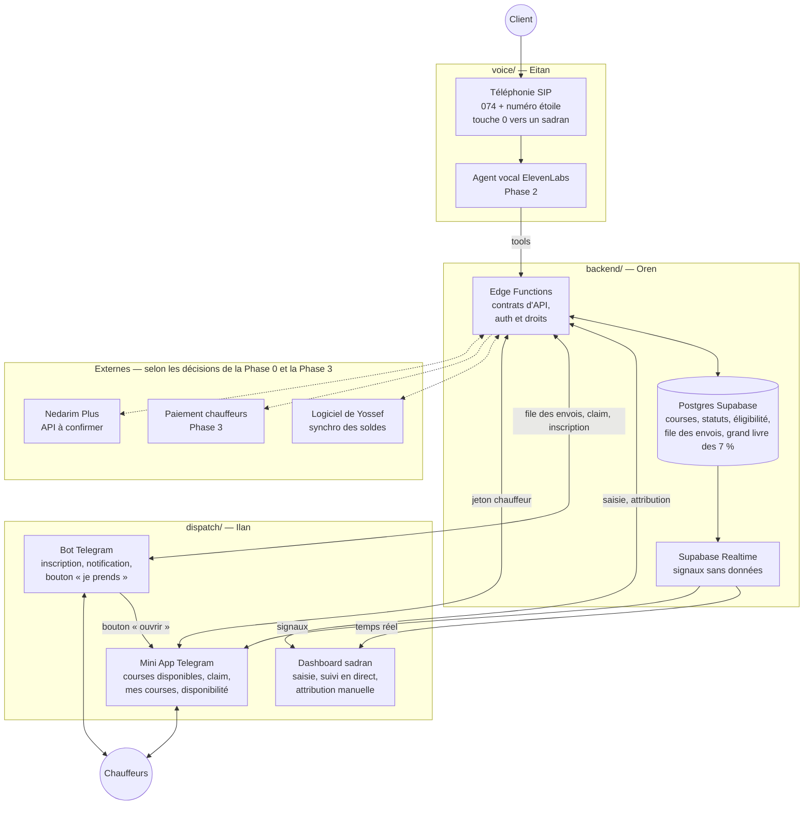
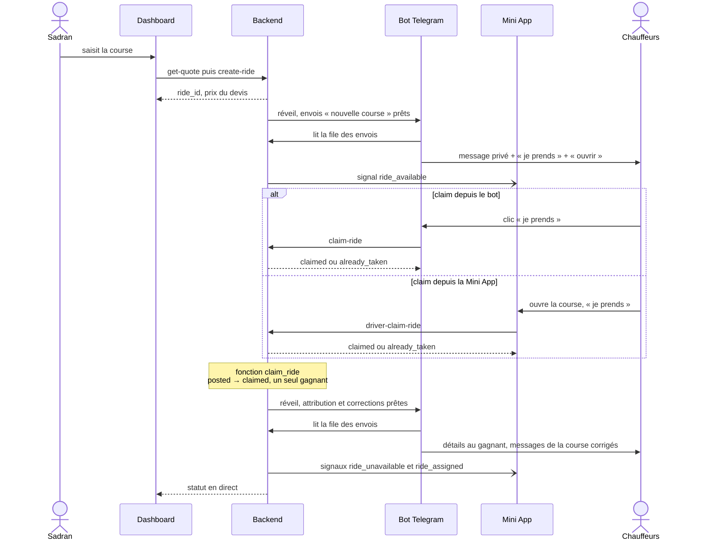
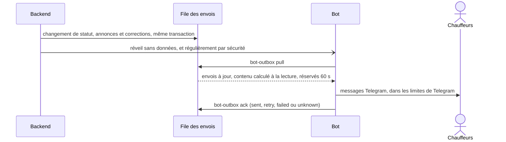
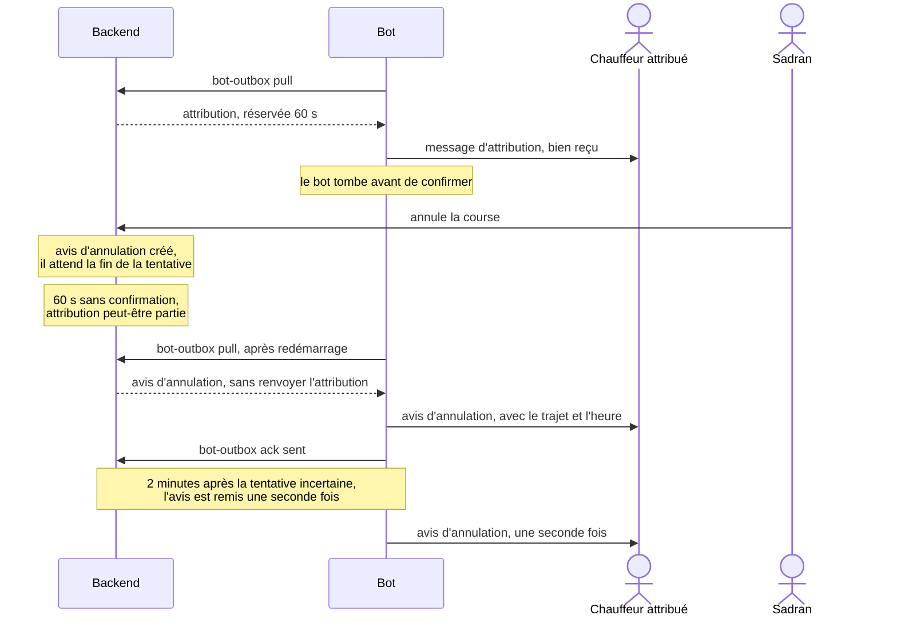
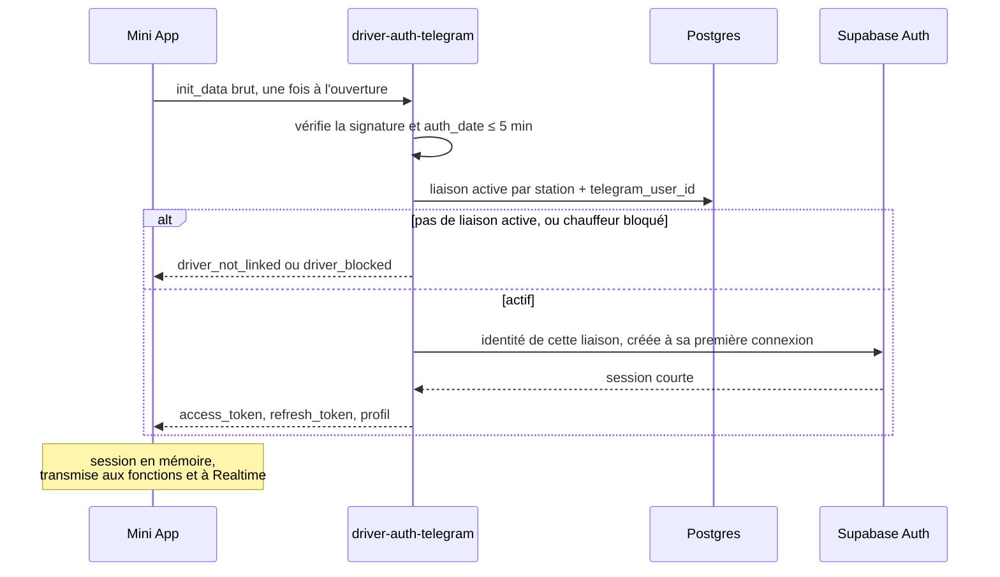
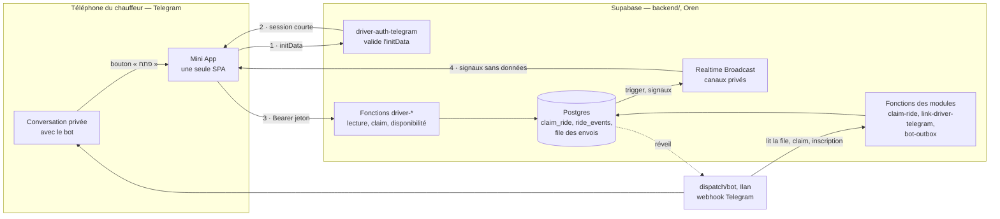

# Architecture

Un seul backend décide et garde la vérité. La voix, le dashboard, le bot et la Mini App ne parlent qu'à lui, via des contrats d'API stables ([`API_CONTRACTS.md`](API_CONTRACTS.md)).

## Vue d'ensemble

Les traits pleins existent dès la Phase 1 (sauf la voix, Phase 2). Les pointillés dépendent de décisions de la Phase 0 ou arrivent en Phase 3.

## Les trois modules

| | `voice/` | `backend/` | `dispatch/` |
| --- | --- | --- | --- |
| Responsable | Eitan | Oren | Ilan |
| Mission | Transformer un appel en commande structurée et confirmée | Source de vérité : prix, courses, statuts, éligibilité, droits, argent, identité des chauffeurs | Notifier les chauffeurs désignés par le backend, leur donner une interface pour prendre la course, informer le sadran |
| Entrées | Audio, numéro appelant, réponses de l'API | Appels des tools, saisies du dashboard, claims du bot et de la Mini App, initData Telegram, confirmations d'envoi du bot, webhooks | File des envois du backend (nouvelle course, changement de statut), signaux temps réel, réponses de l'API |
| Sorties | Appels aux tools, transfert humain, fin d'appel | Course persistée, devis et prix verrouillé, statut, envois pour le bot, signaux temps réel, sessions des chauffeurs | Claims, attributions manuelles, inscriptions Telegram, disponibilité, confirmations d'envoi, mesures du pilote |
| Outils | Trunk SIP israélien, ElevenLabs Agents | Supabase (Postgres, RLS, Edge Functions, Auth, Realtime) | Telegram Bot API, Telegram Mini Apps, applications web |
| Démarre | Prototype en Phase 1, production en Phase 2 | Phase 1 | Phase 1 |

## Les trois interfaces de `dispatch/`

| | Bot Telegram — `dispatch/bot/` | Mini App Telegram — `dispatch/miniapp/` | Dashboard — `dispatch/dashboard/` |
| --- | --- | --- | --- |
| Pour qui | Chauffeurs | Chauffeurs | Sadranim, Yossef |
| Rôle | Canal principal en Phase 1 : inscription (partage du contact), notification de chaque course, bouton « je prends », message privé au gagnant | Complément du bot : vue d'ensemble pour le chauffeur — courses disponibles, détail, claim, mes courses, disponibilité, profil ([`MINIAPP.md`](MINIAPP.md)) | Saisie, suivi en direct, attribution manuelle, gestion des chauffeurs |
| Parle au backend avec | `x-driverss-key`, secret du module, côté serveur | Jeton de session du chauffeur, aucun secret | Session d'un sadran (table `dispatchers`, avec un rôle), aucun secret |
| Apprend les changements par | La file des envois (contrat T), lue quand le backend le réveille | Signaux temps réel + relecture, repli polling | Realtime |
| Phase | 1 — chemin garanti pour la porte G1 | 1, après le bot ; G1 n'en dépend pas | 1 |

Le bot et la Mini App se complètent ; en Phase 1, le bot est le canal principal (D-009). Le bot pousse la course (Telegram notifie même quand la Mini App est fermée) et garde un claim complet en un clic, qui marche aussi sur les téléphones où la Mini App ne s'ouvre pas (filtres, vieille version de Telegram). La Mini App donne la vue d'ensemble : liste en direct, détail, mes courses, disponibilité.

## Frontières

**La Mini App ne fait jamais :**

- calculer, estimer ou ajuster un prix : elle formate `price_agorot` reçu du backend ;
- décider qui peut voir, recevoir ou prendre une course : elle affiche ce que le backend renvoie ;
- attribuer une course localement, ni afficher « c'est à vous » avant la réponse du backend ;
- lire ou écrire en base directement : seulement les fonctions `driver-*` (contrats J à O) et les canaux temps réel (P) ;
- contenir un secret : ni `service_role`, ni `x-driverss-key`, ni token du bot — son code tourne sur le téléphone du chauffeur ;
- se fier à `initDataUnsafe` pour autre chose que l'affichage ;
- garder des données client après la course : pas de cache persistant des détails de prise en charge.

**Le backend possède :**

- la validation de l'authentification : initData, liaisons Telegram, sessions, révocation ;
- les droits : quel appelant peut faire quoi, dans quelle station (tableau « Qui peut appeler quoi » dans [`API_CONTRACTS.md`](API_CONTRACTS.md)) ;
- la vérité des courses et toutes les transitions de statut ;
- l'éligibilité : qui est notifié, qui voit une course, qui peut la prendre ;
- la concurrence du claim et de l'attribution manuelle ;
- les règles métier : prix et devis, fermetures, grand livre ;
- l'historique d'audit (`ride_events`, `driver_events`), claims refusés compris ;
- les signaux temps réel et la file des envois du bot : qui reçoit quoi, et quand.

## Le flux d'une course en Phase 1

Si personne ne prend la course en 60 secondes : le backend la relance aux chauffeurs disponibles à ce moment-là (destinataires recalculés), puis le sadran l'attribue à la main depuis le dashboard (`assign-ride`, même fonction atomique que le claim). Le chauffeur attribué est prévenu par le bot (envoi R) et par la Mini App (signal `ride_assigned`).

## Éligibilité (Phase 1)

Calculée par le backend uniquement. Ni le bot, ni la Mini App, ni le dashboard n'ajoutent ou ne retirent quelqu'un.

| Action | Qui | Où c'est appliqué |
| --- | --- | --- |
| Être notifié d'une nouvelle course | Chauffeur de la station, `active`, Telegram lié, disponible | Envois « nouvelle course » (D), puis relance à 60 s avec des destinataires recalculés |
| Voir la course dans la Mini App et la prendre | Chauffeur de la station, `active`, Telegram lié. La disponibilité n'est pas exigée : prendre une course, c'est se déclarer disponible pour elle | `driver-rides`, `claim_ride` |
| Recevoir une attribution manuelle | Tout chauffeur `active` de la station, lié à Telegram ou non (sinon le sadran l'appelle) | `claim_ride`, appelée par `assign-ride` |

Disponible = `is_available` et `available_until` non dépassé ([`DATABASE.md`](DATABASE.md)). Pas en Phase 1 : zones, rayon, GPS, véhicule, niveaux de chauffeur. Un chauffeur en retard de paiement (Phase 3) passera par `status = blocked`, déjà prévu.

## Envois du bot : fiabilité

Le bot est le canal principal (D-009) : ses envois doivent survivre à une panne, ne jamais laisser un chauffeur sur une information fausse sans la corriger, et respecter les limites de Telegram. Proposition D-019, à valider par Oren et Ilan. Contrats : D, R et T dans [`API_CONTRACTS.md`](API_CONTRACTS.md).

Deux familles d'envois :

- une **annonce** apporte une nouveauté par un nouveau message : diffusion, relance, attribution au gagnant. Périmée avant que le bot la lise, elle est abandonnée ;
- une **correction** remet à jour ce que le chauffeur a déjà reçu : modification d'un message connu, avis d'annulation. Elle n'est jamais abandonnée parce que la course a changé : son contenu est calculé par le backend au moment où le bot la lit, selon l'état actuel.

| Règle | Comment |
| --- | --- |
| Rien ne se perd | Les envois sont créés dans la même transaction que le changement qui les rend nécessaires. Un envoi lu reste réservé 60 s ; sans réponse, il revient dans la file. Si le bot redémarre au milieu d'une diffusion, seuls les envois non confirmés repartent. |
| Chaque message est suivi | Un message dont le bot confirme l'envoi devient un **message connu** (`bot_messages`), avec l'état qu'il affiche. À chaque changement de statut, le backend crée une correction pour chaque message connu de la course qui n'affiche plus le bon état : diffusion et relance, chez tous les destinataires, gagnant compris, et le message d'attribution si la course est annulée. Quel que soit le canal du claim ou de l'attribution : bot, Mini App ou dashboard. |
| Une absence de confirmation ne prouve rien | Telegram peut avoir reçu le message alors que le bot tombe avant de confirmer. Un envoi lu et jamais confirmé (réponse `unknown`, ou réservation expirée) est **peut-être parti**, pour toujours. |
| Annulation d'une course attribuée | L'avis d'annulation part toujours, que le message d'attribution soit parti ou non : le chauffeur a pu apprendre l'attribution par la Mini App (qui affiche l'adresse et le téléphone dès le claim), par la réponse du bot à son clic ou par un appel du sadran. L'avis attend seulement qu'une tentative d'attribution en cours soit réglée, pour arriver après elle. S'il ne peut pas partir (pas de liaison active, bot bloqué, échecs répétés), la course est signalée au sadran, qui appelle le chauffeur. Prix assumé : un chauffeur peut recevoir un avis d'annulation pour une attribution qu'il n'a jamais vue ; l'avis rappelle le trajet et l'heure. |
| Confirmation tardive | Une confirmation `sent` d'un nouveau message, arrivée après la fin de sa réservation, est toujours enregistrée : le message existe. Le backend le compare aussitôt à l'état actuel de la course et le corrige si besoin. Les autres réponses d'une tentative dépassée sont ignorées. |
| Ordre des corrections | Une seule correction en cours par message. Le bot ne commence rien après `send_before` et coupe ses appels à Telegram au bout de 10 s : il est très improbable qu'une tentative arrive après la fin de sa réservation, mais ce n'est pas garanti, car un délai dépassé côté bot ne prouve pas que Telegram n'a pas traité la requête. Après chaque confirmation, le backend recompare l'état affiché à l'état actuel et crée une nouvelle correction s'ils diffèrent ; l'état enregistré d'un message ne recule jamais. |
| Vérification après une issue incertaine | Une issue est incertaine après une réponse `unknown`, une réservation expirée sans réponse, ou la confirmation tardive d'une ancienne modification (elle a pu être appliquée après une plus récente). Deux minutes plus tard, le backend rétablit une fois l'état juste : il réapplique l'état actuel du message, même s'il est censé l'afficher déjà (Telegram répond « déjà identique », ou corrige) ; et si une attribution à l'issue incertaine a été suivie d'une annulation dans ces 2 minutes, l'avis d'annulation repart une seconde fois. |
| Relance | Tâche planifiée du backend à 60 s, pas un minuteur du bot, qui se perdrait au redémarrage. Elle verrouille la course comme une transition : requête conditionnelle (encore `posted`, pas encore relancée), puis, dans la même transaction, l'événement `relaunched` et les annonces de relance. Un claim simultané attend ce verrou : passé avant, il empêche la relance ; passé après, il fait corriger chaque message de relance confirmé. Destinataires recalculés à ce moment-là (un chauffeur bloqué ou devenu indisponible n'est pas relancé), sauf ceux dont la diffusion n'est pas encore partie. Une seule relance par course. |
| Limites de Telegram | Moins de 30 messages par seconde au total, au plus un par seconde au même chauffeur, modifications comprises. Sur un refus 429, réponse `retry` avec le délai indiqué par Telegram ; après 5 tentatives sans succès, l'envoi passe en échec. |
| Limite acceptée | Un message parti dont la confirmation n'arrive jamais a un identifiant inconnu : le backend ne peut pas le corriger. Quand un chauffeur appuie sur son bouton, le bot affiche la réponse du backend et corrige ce message-là. C'est un secours, qui ne couvre pas un chauffeur qui ne clique pas. Cas rare (le bot doit tomber entre la réponse de Telegram et sa confirmation), compté chaque semaine. Autre limite : une requête que Telegram traiterait plus de 2 minutes après coup échappe à la vérification. Elle ne peut que changer le libellé d'un message déjà sans bouton, ou faire réapparaître une attribution déjà suivie de deux avis d'annulation ; jugé improbable, et compté. |

Le cas le plus délicat : Telegram a reçu l'attribution, mais le bot est tombé avant de la confirmer, puis la course est annulée.

**Échecs et signalements.** Les signalements (table `dispatcher_alerts`) restent visibles dans le dashboard jusqu'à ce qu'un sadran les traite.

| Cas | Annonce | Correction |
| --- | --- | --- |
| La course a changé avant la lecture | Abandonnée. Si c'est une attribution et que la course est annulée, l'avis d'annulation part quand même | Gardée ; contenu recalculé |
| Fermeture (Shabbat, fête) | Gardée, même si le bot l'avait lue juste avant (il ne peut plus la commencer) ; à la réouverture, abandonnée si la course a changé, ou, pour une diffusion ou une relance, si l'heure de prise en charge est passée | Gardée ; part à la réouverture avec l'état du moment |
| Liaison révoquée | Abandonnée ; une attribution non remise est signalée | Abandonnée ; un avis d'annulation non remis est signalé |
| Message introuvable ou plus modifiable | — | Échec, sans signalement : il n'y a plus rien à corriger chez le chauffeur |
| Le chauffeur a bloqué le bot | Échec ; le chauffeur est signalé une fois, et une attribution non remise aussi | Échec ; un avis d'annulation non remis est signalé |
| 5 tentatives sans succès | Échec ; une attribution non remise est signalée | Échec ; un avis d'annulation non remis est signalé |

Écartée : garder l'appel direct du backend vers le bot et donner au bot sa propre mémoire des envois. C'était plus de logique dans le bot, et une exception à la règle d'or 1.

## Fermetures et pannes

- **Shabbat et fêtes (D-020, proposée) :** pendant une fermeture (table `closures`), rien ne part et aucune relance n'a lieu : la file ne remet rien au bot. La limite d'envoi d'un envoi déjà lu (`send_before`) s'arrête 1 minute avant le début de la fermeture : un envoi lu juste avant ne peut pas commencer pendant. Les envois créés ou en attente sont gardés, corrections comprises, et réévalués à la réouverture : les corrections partent avec l'état du moment ; une annonce périmée est abandonnée (course changée ; pour une diffusion ou une relance, aussi heure de prise en charge passée) ; une relance due est recalculée. Avant l'entrée, le dashboard signale les courses encore libres. Dès la Phase 1, pas seulement pour la voix.
- **Panne du backend ou du bot :** les sadranim reprennent à la main, selon une procédure écrite (tâche SOC-12). À la reprise, la file repart d'elle-même : les annonces périmées sont abandonnées, les corrections partent.

## Authentification des chauffeurs (Mini App)

**Principe :** l'initData de Telegram est validé une seule fois par le backend, puis échangé contre une session Supabase courte. La Mini App n'envoie pas l'initData brut à chaque requête.

Pourquoi pas l'initData à chaque requête :

- l'initData est créé à l'ouverture de la Mini App et n'est jamais renouvelé ensuite. Il faudrait soit accepter un `auth_date` vieux de plusieurs heures (longue fenêtre de rejeu), soit casser la session au bout de quelques minutes ;
- les canaux temps réel privés et RLS de Supabase demandent un JWT ;
- la vérification serait recopiée dans chaque fonction.

| Sujet | Règle |
| --- | --- |
| Qui valide | Uniquement `driver-auth-telegram`, côté backend. Vérification du `hash` selon la documentation Telegram (HMAC-SHA256, clé dérivée du token du bot de la station), comparaison en temps constant, bibliothèque éprouvée et vecteurs de test. |
| Fraîcheur | `auth_date` de moins de 300 s (réglable : `TELEGRAM_INITDATA_MAX_AGE_S`), et pas plus de 60 s dans le futur. Sinon `init_data_expired` : la Mini App demande de la fermer et de la rouvrir. |
| Identité | Seul `user.id` compte : c'est le `telegram_user_id` de la liaison active (`driver_links`, entier 64 bits). Le nom, le pseudo et la photo ne servent qu'à l'affichage. `start_param` sert à la navigation, jamais à autoriser. |
| Station | Déduite du bot dont le token valide la signature, jamais envoyée par le client. Un seul bot en Phase 1 ; un bot par station en Phase 4. |
| Correspondance Telegram → chauffeur | Pas de création de chauffeur à la connexion, sinon n'importe quel compte Telegram deviendrait chauffeur. Le chauffeur est pré-inscrit (import, ou contrat S par un `admin`) avec son téléphone, puis lié par le bot quand il partage son contact (contrat Q). Une seule liaison active par chauffeur, et par compte Telegram dans une station. Inconnu ou délié → `driver_not_linked` ; bloqué → `driver_blocked`. |
| Utilisateur Supabase | Une identité Supabase Auth par liaison Telegram (`driver_links.auth_user_id`, D-022), créée par le backend à la première connexion qui suit la liaison, sans mot de passe ni e-mail réel. Une nouvelle liaison reçoit une nouvelle identité ; le `driver_id`, les courses et l'historique comptable ne changent pas. Inscriptions publiques et connexions anonymes désactivées dans le projet. |
| Émission de la session | (a) Recommandé : session Supabase Auth émise côté serveur pour l'utilisateur lié — rafraîchissement et révocation fournis par Supabase. (b) Repli : JWT signé par le backend avec une clé de signature du projet, avec notre propre rafraîchissement. Choix tranché par le prototype jetable TMA-03 ; avec (a), le contrat J ne change pas pour la Mini App. |
| Durée de vie | Jeton d'accès d'une heure au plus, rafraîchi automatiquement par supabase-js et transmis à Realtime. Session gardée en mémoire seulement (`persistSession: false`) : chaque ouverture de la Mini App refait l'échange. |
| Utilisation | Les fonctions `driver-*` exigent `Authorization: Bearer <access_token>`, vérifient le jeton, retrouvent la liaison **active** par `auth_user_id`, puis le chauffeur, et relisent son statut à chaque appel. Un jeton d'une liaison révoquée est refusé (`driver_not_linked`), même avant son expiration. L'identité ne vient jamais du corps de la requête. |
| RLS | Les chauffeurs n'ont **aucune** politique sur les tables métier : RLS étant activé partout, tout est refusé. Leur seule politique : recevoir les messages de leurs canaux sur `realtime.messages`, par une fonction d'aide qui vérifie la liaison active et le chauffeur sans leur ouvrir les tables ([`DATABASE.md`](DATABASE.md)). Chauffeurs et sadranim étant tous deux `authenticated`, aucune politique ne s'appuie sur ce seul rôle. |
| Révocation | **Bloquer** (contrat S, rôle `admin`) met `status = 'blocked'` et révoque les sessions : effet immédiat sur les fonctions `driver-*`, le claim et l'ouverture d'un canal temps réel. **Délier** (S, `unlink_telegram`, D-022) passe d'abord la liaison à `revoked` en base, ce qui refuse l'ancien jeton dès l'appel suivant, même si la suite échoue ; ensuite seulement, l'identité Supabase de la liaison est supprimée, en réessayant. Supprimer une identité ne suffirait pas seul : un jeton déjà émis reste valable jusqu'à son expiration. Dans les deux cas, un canal temps réel déjà ouvert peut encore recevoir des signaux, sans donnée personnelle, jusqu'à l'expiration du jeton (une heure au plus). |
| Téléphone perdu ou volé | 1. Le chauffeur appelle le sadran ; un `admin` délie avec la raison `compromised` : l'ancien téléphone perd l'accès tout de suite, et partager le contact ne suffit plus pour se relier (Q, `link_requires_admin`). 2. Le chauffeur récupère un téléphone ; s'il garde le même compte Telegram, il ferme d'abord les autres sessions (Telegram : Paramètres → Appareils). 3. Au téléphone avec lui, l'admin autorise une nouvelle liaison pendant 15 minutes (S, `allow_relink`), en précisant si l'ancien compte est accepté. 4. Le chauffeur partage son contact dans le bot : nouvelle liaison, nouvelle identité, mêmes courses et même historique. |
| Journaux | Jamais d'initData, de jeton ni de numéro complet dans les logs. Les refus sont comptés par code pour le pilote. |

## Temps réel

**Recommandé :** signaux Broadcast sur des canaux privés, relecture par l'API, repli par polling.

| Option | Pour | Contre | Verdict |
| --- | --- | --- | --- |
| `postgres_changes` sur `rides` | Rien à émettre côté backend | Envoie les colonnes de la ligne (adresse, `customer_id`…) à tout abonné qui passe le filtre RLS de ligne ; RLS réévalué pour chaque abonné à chaque changement | Non pour les chauffeurs. Acceptable pour le dashboard : les sadranim voient déjà les lignes de leur station |
| Broadcast privé, émis par trigger | Charge utile choisie par nous, sans donnée personnelle ; autorisation par RLS sur `realtime.messages` ; émis à chaque changement, quel que soit le canal d'origine | Un trigger à écrire ; un message manqué n'est pas rejoué | **Recommandé**, en « signal + relecture » |
| Polling seul | Le plus simple ; passe derrière tous les filtres | Latence, requêtes inutiles | Repli obligatoire, pas mode principal |

| Canal | Qui peut écouter | Événements |
| --- | --- | --- |
| `rides:{station_id}` | Chauffeurs `active` de la station | `ride_available`, `ride_unavailable` (`reason` : `claimed` ou `cancelled`) |
| `driver:{driver_id}` | Ce chauffeur seulement | `ride_assigned` (`via` : `telegram_bot`, `miniapp`, `dashboard`), `ride_cancelled`, `ride_closed` |

| Ce que la Mini App doit apprendre | Comment |
| --- | --- |
| Nouvelle course | `ride_available` |
| Course prise par un autre, ou annulée avant d'être prise | `ride_unavailable` |
| Course qui devient la mienne : mon claim depuis le bot ou un autre appareil, attribution par le sadran | `ride_assigned` |
| Ma course annulée ou close | `ride_cancelled`, `ride_closed` |
| Claim réussi ou refusé | Réponse directe de `driver-claim-ride` — ce n'est pas un signal |

Règles :

- **Émission :** un trigger sur `rides` appelle `realtime.send` à chaque changement de statut (dont le passage à `posted`), dans la même transaction : rien ne part si elle échoue. Charge utile : `ride_id`, `version`, type, horodatage, et `reason`, `via` ou `status`. Jamais d'adresse, de nom ni de téléphone.
- **Canaux privés seulement :** l'accès public aux canaux est désactivé. Les clients ne peuvent pas émettre (aucune politique d'insertion sur `realtime.messages`).
- **Signal + relecture :** à chaque signal, la Mini App relit l'état par `driver-rides`, en regroupant les signaux sur 500 ms. Elle relit aussi à l'abonnement et au retour au premier plan, puisque les signaux manqués ne sont pas rejoués. Une réponse dont la `version` est plus ancienne que celle déjà affichée est ignorée.
- **Repli :** si le canal n'est pas abonné après 10 s, ou se coupe, relecture toutes les 20 s tant que la Mini App est visible ; arrêt dès que le canal revient. Les filtres de certains téléphones peuvent bloquer les WebSockets : ce repli doit suffire à lui seul.

Détail du contrat : P dans [`API_CONTRACTS.md`](API_CONTRACTS.md).

## Claim : déroulé exact

1. Le chauffeur appuie sur « אני לוקח » : bouton principal de la Mini App, ou bouton du message du bot.
2. La Mini App appelle `driver-claim-ride` avec seulement `ride_id` : le chauffeur vient du jeton. Le bot appelle `claim-ride` avec `ride_id` et le `telegram_user_id` de l'auteur du clic, reçu par son webhook vérifié.
3. Le backend retrouve le chauffeur et appelle la fonction SQL `claim_ride` — la même pour le bot, la Mini App et le dashboard (`assign-ride`).
4. `claim_ride` fait **une seule requête conditionnelle** : la course passe à `claimed` seulement si elle est encore `posted` et si le chauffeur est `active` dans la même station. La `version` augmente de 1 et l'événement `ride_events` est écrit dans la même transaction. Esquisse SQL : [`DATABASE.md`](DATABASE.md).
5. Dans la même transaction : signaux `ride_unavailable` (station) et `ride_assigned` (gagnant), et envois R dans la file du bot — l'attribution au gagnant, avec les détails en message privé, et une correction de chaque message connu de la course, gagnant compris.

**Deux chauffeurs au même instant**, quel que soit leur canal : Postgres verrouille la ligne ; la deuxième mise à jour attend la première, relit `status`, trouve `claimed` et ne modifie rien → `already_taken`.

**Un claim et une annulation du sadran au même instant :** la transaction qui verrouille la ligne en premier passe.

- Annulation d'abord : le claim reçoit `not_claimable`.
- Claim d'abord : l'annulation s'applique ensuite à la course prise (`claimed → cancelled` est permis), et le chauffeur est prévenu (avis d'annulation R, signal `ride_cancelled`).

Pour que l'annulation soit refusée quand la course a changé depuis que le sadran l'a vue, le dashboard envoie `expected_version` (contrat G) : course modifiée entre-temps → `version_conflict`, le dashboard relit et le sadran décide.

| Cas | Réponse | Ce que voit le chauffeur |
| --- | --- | --- |
| Premier claim valide | `ok: true`, course avec les détails de prise en charge | « הנסיעה שלך! », adresse, téléphone, notes ; vibration de succès |
| Même chauffeur, deuxième appel (double appui, réponse perdue) | `ok: true`, `replay: true` | Le même écran ; rien de nouveau en base |
| Prise par un autre entre-temps | `already_taken` | « הנסיעה כבר נלקחה », retour à la liste |
| Annulée ou close | `not_claimable` | « הנסיעה כבר לא זמינה » |
| Chauffeur bloqué | `driver_blocked` | Écran « compte suspendu » + « התקשר לסדרן » |

Chaque refus est journalisé (`claim_rejected`, avec la raison et le canal) : c'est ce qui tranche un « j'ai cliqué le premier ».

**Ce que voit un chauffeur**

| Donnée | Avant le claim — tout chauffeur éligible | Après le claim — le chauffeur attribué, tant que `claimed` | Après clôture |
| --- | --- | --- | --- |
| Trajet (ville, quartier), horaire, type, passagers, prix | Oui | Oui | Non (pas d'historique en Phase 1) |
| `message_text` (format habituel, sans donnée client) | Oui | Oui | Non |
| Adresse de prise en charge | Non | Oui | Non |
| Téléphone du client | Non | Oui | Non |
| Notes du sadran | Non | Oui | Non |
| Nom du client | Non | Non (Phase 1) | Non |

Pas en Phase 1 : la « demande » soumise à l'accord d'un sadran, l'heure d'arrivée estimée, le désistement par le chauffeur. S'il se désiste, il appelle le sadran, qui annule la course et la recrée ; la nouvelle course garde le lien vers l'ancienne (`replaces_ride_id`).

## Mini App : vue technique

## Principes de conception

- **Le backend décide.** Les statuts critiques ne s'écrivent que par une fonction backend atomique, jamais directement depuis un frontend ou un bot.
- **Un seul chemin par action.** Bot, Mini App et dashboard prennent ou attribuent une course par la même fonction SQL.
- **Multi-stations dès le premier jour.** Chaque table métier porte `station_id`. Plus tard, chaque station aura sa marque, sa voix, ses zones et ses règles.
- **Un humain toujours joignable.** Transfert vers un sadran à tout moment (voix), attribution manuelle à tout moment (dispatch), bouton « appeler le sadran » dans la Mini App, et retour au manuel si le système tombe.
- **Les chauffeurs gardent leurs codes.** Le message de course reprend le format qu'ils utilisent aujourd'hui.
- **Le vocabulaire local est un chantier à part entière.** Dictionnaire des villes, quartiers, synagogues et termes yiddish ; confirmation de l'adresse à voix haute.
- **Ne pas reconstruire ce qui existe.** Paiement, facturation et téléphonie passent par des prestataires israéliens.
- **Remplaçable par module.** Tant que les contrats restent stables, ElevenLabs peut être remplacé par un autre fournisseur, Supabase par un autre backend.

## Sécurité

- La clé `service_role` de Supabase reste côté serveur. Le dashboard et la Mini App n'ont que la clé `anon` (publique par conception) et le jeton de leur utilisateur ; les actions critiques passent par des fonctions serveur.
- Chaque appel entre modules est authentifié par un secret propre au module, y compris le réveil du bot par le backend (voir [`API_CONTRACTS.md`](API_CONTRACTS.md)) ; chaque appel d'un chauffeur ou d'un sadran, par son jeton de session. Ce que chacun a le droit de faire : tableau « Qui peut appeler quoi ».
- Le webhook Telegram vérifie l'en-tête secret fourni par Telegram. Le webhook de fin d'appel ElevenLabs vérifie sa signature.
- Jamais de numéro ni de nom de client dans un message, un écran ou un signal temps réel vu par plusieurs chauffeurs.
- Les fonctions SQL `security definer` vivent dans un schéma non exposé par l'API. Chacune reçoit ses droits explicitement dans sa migration, et un test contrôle les droits effectifs ([`DATABASE.md`](DATABASE.md)) : celles qui modifient des données, dont `claim_ride`, ne sont exécutables ni par `anon` ni par `authenticated` ; seules les fonctions d'aide RLS, en lecture seule, le sont par `authenticated`.
- Délier un chauffeur coupe l'accès de l'ancienne liaison Telegram dès l'appel suivant ; après un vol, la nouvelle liaison passe par un `admin` (D-022).
- Les fonctions `driver-*` n'acceptent que l'origine de la Mini App (CORS).
- Enregistrements d'appels dans un stockage privé. Durée de conservation à fixer avec l'avocat (amendement 13).
