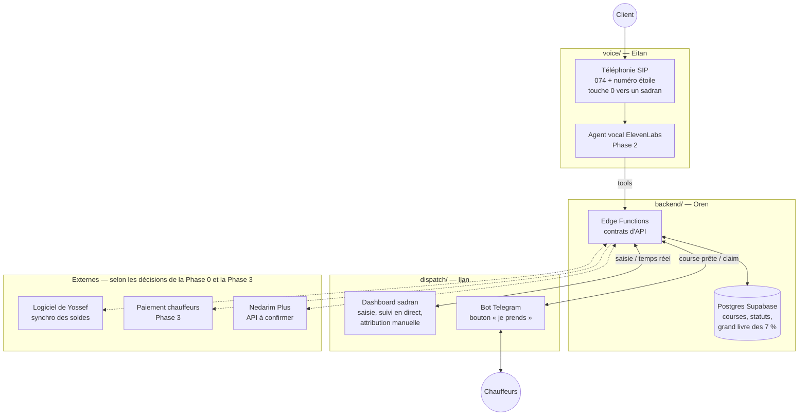
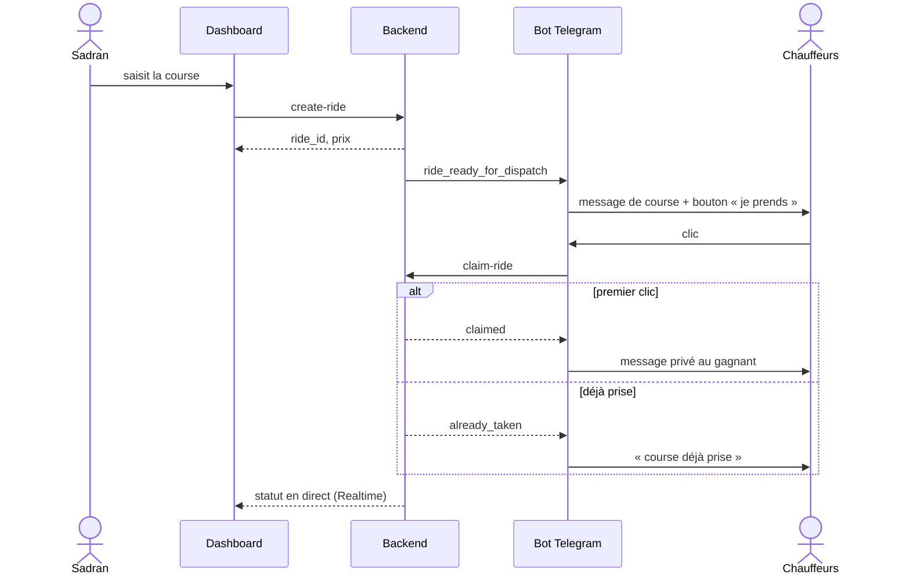

# Architecture

Un seul backend décide et garde la vérité. La voix, le dashboard et le bot ne parlent qu'à lui, via des contrats d'API stables ([`API_CONTRACTS.md`](API_CONTRACTS.md)).

## Vue d'ensemble

Les traits pleins existent dès la Phase 1 (sauf la voix, Phase 2). Les pointillés dépendent de décisions de la Phase 0 ou arrivent en Phase 3.

## Les trois modules

| | `voice/` | `backend/` | `dispatch/` |
| --- | --- | --- | --- |
| Responsable | Eitan | Oren | Ilan |
| Mission | Transformer un appel en commande structurée et confirmée | Source de vérité : prix, courses, statuts, argent | Trouver le chauffeur et informer le sadran |
| Entrées | Audio, numéro appelant, réponses de l'API | Appels des tools, saisies du dashboard, claims du bot, webhooks | Événement « course prête », statut des courses |
| Sorties | Appels aux tools, transfert humain, fin d'appel | Course persistée, prix verrouillé, statut, événements | Claim, attribution manuelle, mesures du pilote |
| Outils | Trunk SIP israélien, ElevenLabs Agents | Supabase (Postgres, RLS, Edge Functions, Realtime) | Telegram Bot API, application web |
| Démarre | Prototype en Phase 1, production en Phase 2 | Phase 1 | Phase 1 |

## Le flux d'une course en Phase 1

Si personne ne prend la course en 60 secondes : le bot la relance à tous les chauffeurs inscrits, puis le sadran l'attribue à la main depuis le dashboard (`assign-ride`, même opération atomique que le claim).

## Principes de conception

- **Le backend décide.** Les statuts critiques ne s'écrivent que par une fonction backend atomique, jamais directement depuis un frontend ou un bot.
- **Multi-stations dès le premier jour.** Chaque table métier porte `station_id`. Plus tard, chaque station aura sa marque, sa voix, ses zones et ses règles.
- **Un humain toujours joignable.** Transfert vers un sadran à tout moment (voix), attribution manuelle à tout moment (dispatch).
- **Les chauffeurs gardent leurs codes.** Le message de course reprend le format qu'ils utilisent aujourd'hui.
- **Le vocabulaire local est un chantier à part entière.** Dictionnaire des villes, quartiers, synagogues et termes yiddish ; confirmation de l'adresse à voix haute.
- **Ne pas reconstruire ce qui existe.** Paiement, facturation et téléphonie passent par des prestataires israéliens.
- **Remplaçable par module.** Tant que les contrats restent stables, ElevenLabs peut être remplacé par un autre fournisseur, Supabase par un autre backend.

## Sécurité

- La clé `service_role` de Supabase reste côté serveur. Le dashboard utilise la clé `anon` + RLS, ou des fonctions serveur.
- Chaque appel entre modules est authentifié par un secret propre au module (voir [`API_CONTRACTS.md`](API_CONTRACTS.md)).
- Le webhook Telegram vérifie l'en-tête secret fourni par Telegram. Le webhook de fin d'appel ElevenLabs vérifie sa signature.
- Jamais de numéro de client dans un message vu par plusieurs chauffeurs.
- Enregistrements d'appels dans un stockage privé. Durée de conservation à fixer avec l'avocat (amendement 13).
