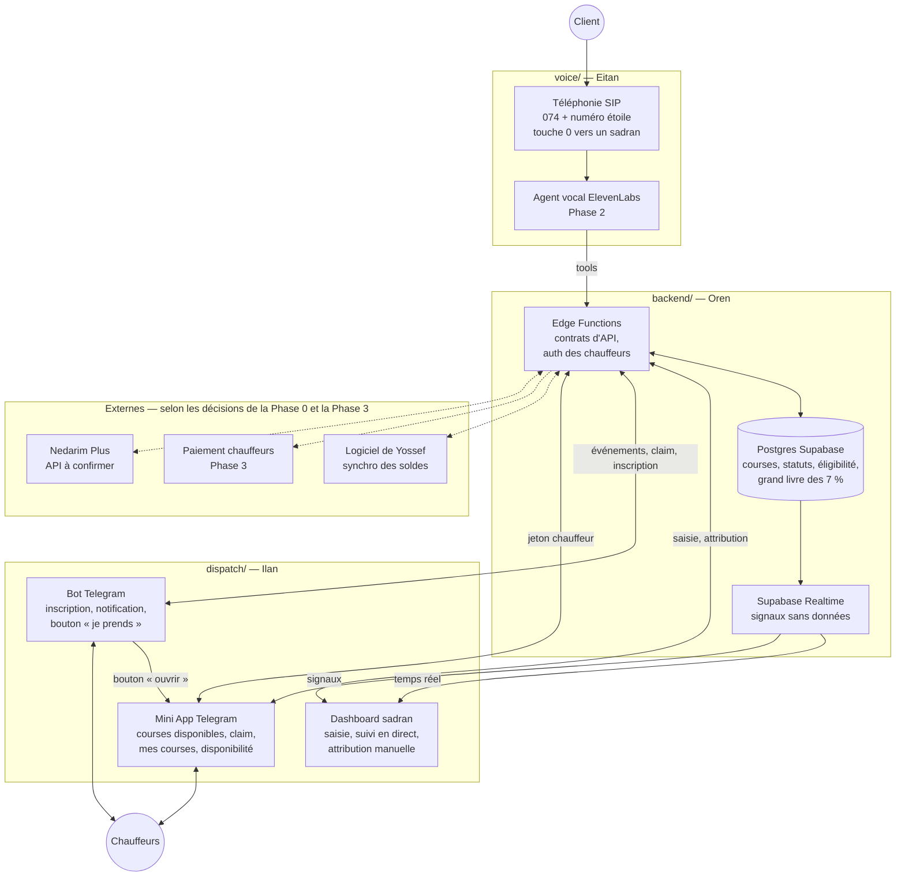
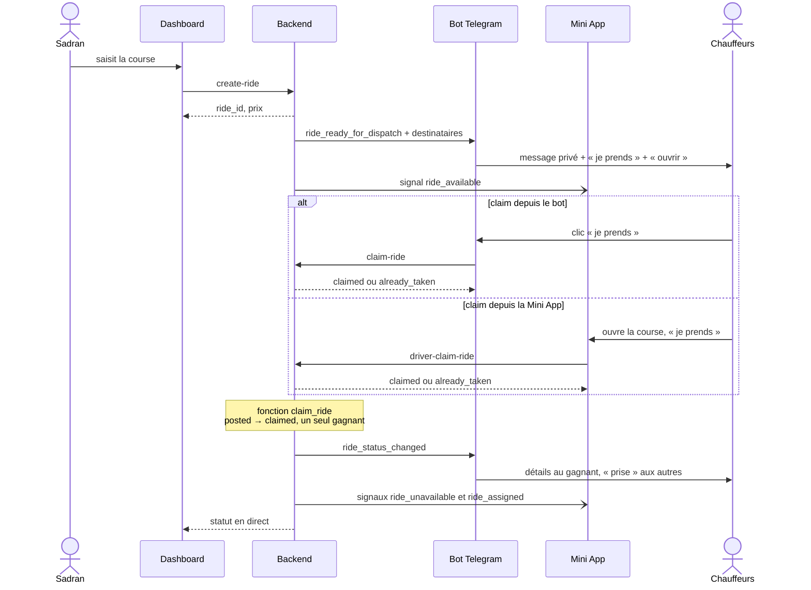
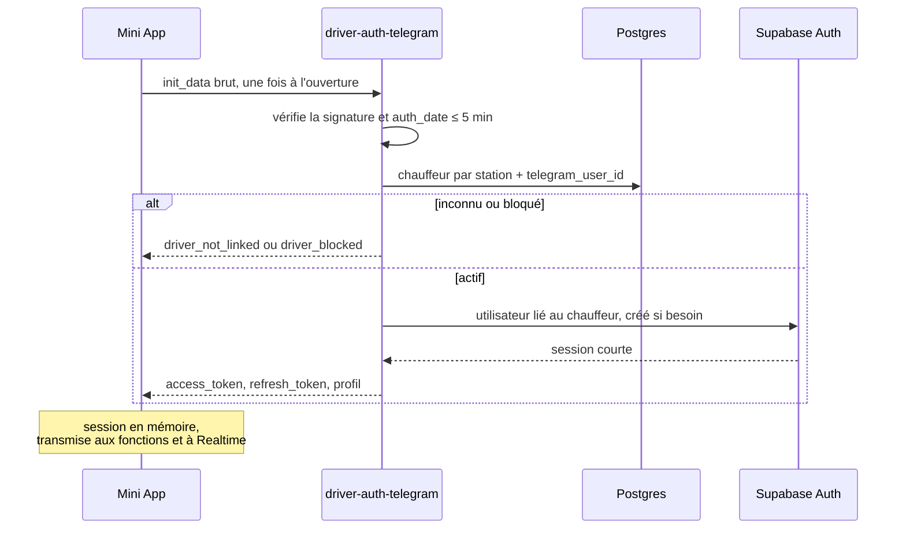
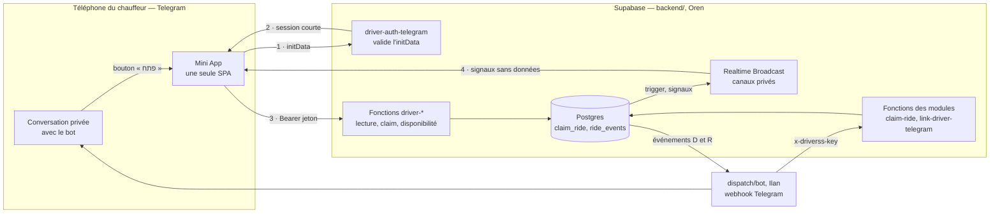

# Architecture

Un seul backend décide et garde la vérité. La voix, le dashboard, le bot et la Mini App ne parlent qu'à lui, via des contrats d'API stables ([`API_CONTRACTS.md`](API_CONTRACTS.md)).

## Vue d'ensemble

Les traits pleins existent dès la Phase 1 (sauf la voix, Phase 2). Les pointillés dépendent de décisions de la Phase 0 ou arrivent en Phase 3.

## Les trois modules

| | `voice/` | `backend/` | `dispatch/` |
| --- | --- | --- | --- |
| Responsable | Eitan | Oren | Ilan |
| Mission | Transformer un appel en commande structurée et confirmée | Source de vérité : prix, courses, statuts, éligibilité, argent, identité des chauffeurs | Notifier les chauffeurs désignés par le backend, leur donner une interface pour prendre la course, informer le sadran |
| Entrées | Audio, numéro appelant, réponses de l'API | Appels des tools, saisies du dashboard, claims du bot et de la Mini App, initData Telegram, webhooks | Événements du backend (`ride_ready_for_dispatch`, `ride_status_changed`), signaux temps réel, réponses de l'API |
| Sorties | Appels aux tools, transfert humain, fin d'appel | Course persistée, prix verrouillé, statut, événements, signaux temps réel, sessions des chauffeurs | Claims, attributions manuelles, inscriptions Telegram, disponibilité, mesures du pilote |
| Outils | Trunk SIP israélien, ElevenLabs Agents | Supabase (Postgres, RLS, Edge Functions, Auth, Realtime) | Telegram Bot API, Telegram Mini Apps, applications web |
| Démarre | Prototype en Phase 1, production en Phase 2 | Phase 1 | Phase 1 |

## Les trois interfaces de `dispatch/`

| | Bot Telegram — `dispatch/bot/` | Mini App Telegram — `dispatch/miniapp/` | Dashboard — `dispatch/dashboard/` |
| --- | --- | --- | --- |
| Pour qui | Chauffeurs | Chauffeurs | Sadranim, Yossef |
| Rôle | Canal principal en V1 : inscription (partage du contact), notification de chaque course, bouton « je prends », message privé au gagnant | Complément du bot : vue d'ensemble pour le chauffeur — courses disponibles, détail, claim, mes courses, disponibilité, profil ([`MINIAPP.md`](MINIAPP.md)) | Saisie, suivi en direct, attribution manuelle, gestion des chauffeurs |
| Parle au backend avec | `x-driverss-key`, secret du module, côté serveur | Jeton de session du chauffeur, aucun secret | Session du sadran, aucun secret |
| Apprend les changements par | Événements D et R | Signaux temps réel + relecture, repli polling | Realtime |
| Phase | 1 — chemin garanti pour la porte G1 | 1, après le bouton du bot ; G1 n'en dépend pas | 1 |

Le bot et la Mini App se complètent ; en V1, le bot est le canal principal (D-009). Le bot pousse la course (Telegram notifie même quand la Mini App est fermée) et garde un claim complet en un clic, qui marche aussi sur les téléphones où la Mini App ne s'ouvre pas (filtres, vieille version de Telegram). La Mini App donne la vue d'ensemble : liste en direct, détail, mes courses, disponibilité.

## Frontières

**La Mini App ne fait jamais :**

- calculer, estimer ou ajuster un prix : elle formate `price_agorot` reçu du backend ;
- décider qui peut voir, recevoir ou prendre une course : elle affiche ce que le backend renvoie ;
- attribuer une course localement, ni afficher « c'est à vous » avant la réponse du backend ;
- lire ou écrire en base directement : seulement les fonctions `driver-*` (contrats J à O) et les canaux temps réel (P) ;
- contenir un secret : ni `service_role`, ni `x-driverss-key`, ni token du bot — son code tourne sur le téléphone du chauffeur ;
- se fier à `initDataUnsafe` pour autre chose que l'affichage ;
- garder des données client après la course : pas de cache persistant des détails de prise en charge.

**Le backend possède :**

- la validation de l'authentification : initData, sessions, révocation ;
- la vérité des courses et toutes les transitions de statut ;
- l'éligibilité : qui est notifié, qui voit une course, qui peut la prendre ;
- la concurrence du claim et de l'attribution manuelle ;
- les règles métier : prix, fermetures, grand livre ;
- l'historique d'audit (`ride_events`), claims refusés compris ;
- les signaux temps réel et les événements envoyés à `dispatch/`.

## Le flux d'une course en Phase 1

Si personne ne prend la course en 60 secondes : le bot la relance aux mêmes destinataires, puis le sadran l'attribue à la main depuis le dashboard (`assign-ride`, même fonction atomique que le claim). Le chauffeur attribué est prévenu par le bot (événement R) et par la Mini App (signal `ride_assigned`).

## Éligibilité (V1)

Calculée par le backend uniquement. Ni le bot, ni la Mini App, ni le dashboard n'ajoutent ou ne retirent quelqu'un.

| Action | Qui | Où c'est appliqué |
| --- | --- | --- |
| Être notifié d'une nouvelle course | Chauffeur de la station, `active`, Telegram lié, disponible | `recipients` de l'événement D |
| Voir la course dans la Mini App et la prendre | Chauffeur de la station, `active`, Telegram lié. La disponibilité n'est pas exigée : prendre une course, c'est se déclarer disponible pour elle | `driver-rides`, `claim_ride` |
| Recevoir une attribution manuelle | Tout chauffeur `active` de la station, lié à Telegram ou non (sinon le sadran l'appelle) | `claim_ride`, appelée par `assign-ride` |

Disponible = `is_available` et `available_until` non dépassé ([`DATABASE.md`](DATABASE.md)). Pas en V1 : zones, rayon, GPS, véhicule, niveaux de chauffeur. Un chauffeur en retard de paiement (Phase 3) passera par `status = blocked`, déjà prévu.

## Authentification des chauffeurs (Mini App)

**Principe :** l'initData de Telegram est validé une seule fois par le backend, puis échangé contre une session Supabase courte. La Mini App n'envoie pas l'initData brut à chaque requête.

Pourquoi pas l'initData à chaque requête :

- l'initData est créé à l'ouverture de la Mini App et n'est jamais renouvelé ensuite. Il faudrait soit accepter un `auth_date` vieux de plusieurs heures (longue fenêtre de rejeu), soit casser la session au bout de quelques minutes ;
- les canaux temps réel privés et RLS de Supabase demandent un JWT ;
- la vérification serait recopiée dans chaque fonction.

| Sujet | Règle |
| --- | --- |
| Qui valide | Uniquement `driver-auth-telegram`, côté backend. Vérification du `hash` selon la documentation Telegram (HMAC-SHA256, clé dérivée du token du bot de la station), comparaison en temps constant, bibliothèque éprouvée et vecteurs de test. |
| Fraîcheur | `auth_date` de moins de 300 s (réglable : `TELEGRAM_INITDATA_MAX_AGE_S`), et pas plus de 60 s dans le futur. Sinon `init_data_expired` : la Mini App demande de la fermer et de la rouvrir. |
| Identité | Seul `user.id` compte : c'est `drivers.telegram_user_id` (entier 64 bits). Le nom, le pseudo et la photo ne servent qu'à l'affichage. `start_param` sert à la navigation, jamais à autoriser. |
| Station | Déduite du bot dont le token valide la signature, jamais envoyée par le client. Un seul bot en V1 ; un bot par station en Phase 4. |
| Correspondance Telegram → chauffeur | Pas de création de chauffeur à la connexion, sinon n'importe quel compte Telegram deviendrait chauffeur. Le chauffeur est pré-inscrit (import ou sadran) avec son téléphone, puis lié par le bot quand il partage son contact (contrat Q). Un compte Telegram par chauffeur et par station. Inconnu → `driver_not_linked` ; bloqué → `driver_blocked`. |
| Utilisateur Supabase | Un utilisateur Supabase Auth par chauffeur (`drivers.auth_user_id`), créé par le backend à la première connexion, sans mot de passe ni e-mail réel. Inscriptions publiques et connexions anonymes désactivées dans le projet. |
| Émission de la session | (a) Recommandé : session Supabase Auth émise côté serveur pour l'utilisateur lié — rafraîchissement et révocation fournis par Supabase. (b) Repli : JWT signé par le backend avec une clé de signature du projet, avec notre propre rafraîchissement. Choix tranché par le prototype jetable TMA-03 ; avec (a), le contrat J ne change pas pour la Mini App. |
| Durée de vie | Jeton d'accès d'une heure au plus, rafraîchi automatiquement par supabase-js et transmis à Realtime. Session gardée en mémoire seulement (`persistSession: false`) : chaque ouverture de la Mini App refait l'échange. |
| Utilisation | Les fonctions `driver-*` exigent `Authorization: Bearer <access_token>`, vérifient le jeton, retrouvent le chauffeur par `auth_user_id` et relisent son statut à chaque appel. L'identité ne vient jamais du corps de la requête. |
| RLS | Les chauffeurs n'ont **aucune** politique sur les tables métier : RLS étant activé partout, tout est refusé. Leur seule politique : recevoir les messages de leurs canaux sur `realtime.messages`. Chauffeurs et sadranim étant tous deux `authenticated`, aucune politique ne s'appuie sur ce seul rôle. |
| Révocation | Bloquer un chauffeur passe par une fonction backend qui met `status = 'blocked'` et révoque ses sessions. Effet immédiat sur les fonctions `driver-*`, sur le claim et sur l'ouverture d'un canal temps réel. Un canal déjà ouvert peut encore recevoir des signaux sans données jusqu'à l'expiration du jeton. |
| Journaux | Jamais d'initData, de jeton ni de numéro complet dans les logs. Les refus sont comptés par code pour le pilote. |

## Temps réel

**Recommandé :** signaux Broadcast sur des canaux privés, relecture par l'API, repli par polling.

| Option | Pour | Contre | Verdict |
| --- | --- | --- | --- |
| `postgres_changes` sur `rides` | Rien à émettre côté backend | Envoie les colonnes de la ligne (adresse, `customer_id`…) à tout abonné qui passe le filtre RLS de ligne ; RLS réévalué pour chaque abonné à chaque changement | Non pour les chauffeurs. Acceptable pour le dashboard : les sadranim voient déjà les lignes de leur station |
| Broadcast privé, émis par trigger | Charge utile choisie par nous, sans donnée personnelle ; autorisation par RLS sur `realtime.messages` ; émis à chaque changement, quel que soit le canal d'origine | Un trigger à écrire ; un message manqué n'est pas rejoué | **Recommandé**, en « signal + relecture » |
| Polling seul | Le plus simple ; passe derrière tous les filtres | Latence, requêtes inutiles | Repli obligatoire, pas mode principal |

| Canal | Qui peut écouter | Événements |
| --- | --- | --- |
| `rides:{station_id}` | Chauffeurs `active` de la station | `ride_available`, `ride_unavailable` (`reason` : `claimed` ou `cancelled`) |
| `driver:{driver_id}` | Ce chauffeur seulement | `ride_assigned` (`via` : `telegram_bot`, `miniapp`, `dashboard`), `ride_cancelled`, `ride_closed` |

| Ce que la Mini App doit apprendre | Comment |
| --- | --- |
| Nouvelle course | `ride_available` |
| Course prise par un autre, ou annulée avant d'être prise | `ride_unavailable` |
| Course qui devient la mienne : mon claim depuis le bot ou un autre appareil, attribution par le sadran | `ride_assigned` |
| Ma course annulée ou close | `ride_cancelled`, `ride_closed` |
| Claim réussi ou refusé | Réponse directe de `driver-claim-ride` — ce n'est pas un signal |

Règles :

- **Émission :** un trigger sur `rides` appelle `realtime.send` à chaque changement de statut (dont le passage à `posted`), dans la même transaction : rien ne part si elle échoue. Charge utile : `ride_id`, type, horodatage, et `reason`, `via` ou `status`. Jamais d'adresse, de nom ni de téléphone.
- **Canaux privés seulement :** l'accès public aux canaux est désactivé. Les clients ne peuvent pas émettre (aucune politique d'insertion sur `realtime.messages`).
- **Signal + relecture :** à chaque signal, la Mini App relit l'état par `driver-rides`, en regroupant les signaux sur 500 ms. Elle relit aussi à l'abonnement et au retour au premier plan, puisque les signaux manqués ne sont pas rejoués.
- **Repli :** si le canal n'est pas abonné après 10 s, ou se coupe, relecture toutes les 20 s tant que la Mini App est visible ; arrêt dès que le canal revient. Les filtres de certains téléphones peuvent bloquer les WebSockets : ce repli doit suffire à lui seul.

Détail du contrat : P dans [`API_CONTRACTS.md`](API_CONTRACTS.md).

## Claim : déroulé exact

1. Le chauffeur appuie sur « אני לוקח » : bouton principal de la Mini App, ou bouton du message du bot.
2. La Mini App appelle `driver-claim-ride` avec seulement `ride_id` : le chauffeur vient du jeton. Le bot appelle `claim-ride` avec `ride_id` et le `telegram_user_id` de l'auteur du clic, reçu par son webhook vérifié.
3. Le backend retrouve le chauffeur et appelle la fonction SQL `claim_ride` — la même pour le bot, la Mini App et le dashboard (`assign-ride`).
4. `claim_ride` fait **une seule requête conditionnelle** : la course passe à `claimed` seulement si elle est encore `posted` et si le chauffeur est `active` dans la même station. L'événement `ride_events` est écrit dans la même transaction. Esquisse SQL : [`DATABASE.md`](DATABASE.md).
5. Après la transaction : signaux `ride_unavailable` (station) et `ride_assigned` (gagnant) ; événement R vers le bot, qui envoie les détails au gagnant en message privé et marque « נלקחה » les messages des autres.

**Deux chauffeurs au même instant**, quel que soit leur canal : Postgres verrouille la ligne ; la deuxième mise à jour attend la première, relit `status`, trouve `claimed` et ne modifie rien → `already_taken`. Une annulation par le sadran au même moment suit la même règle : la première opération passe, l'autre reçoit un refus explicite.

| Cas | Réponse | Ce que voit le chauffeur |
| --- | --- | --- |
| Premier claim valide | `ok: true`, course avec les détails de prise en charge | « הנסיעה שלך! », adresse, téléphone, notes ; vibration de succès |
| Même chauffeur, deuxième appel (double appui, réponse perdue) | `ok: true`, `replay: true` | Le même écran ; rien de nouveau en base |
| Prise par un autre entre-temps | `already_taken` | « הנסיעה כבר נלקחה », retour à la liste |
| Annulée ou close | `not_claimable` | « הנסיעה כבר לא זמינה » |
| Chauffeur bloqué | `driver_blocked` | Écran « compte suspendu » + « התקשר לסדרן » |

Chaque refus est journalisé (`claim_rejected`, avec la raison et le canal) : c'est ce qui tranche un « j'ai cliqué le premier ».

**Ce que voit un chauffeur**

| Donnée | Avant le claim — tout chauffeur éligible | Après le claim — le chauffeur attribué, tant que `claimed` | Après clôture |
| --- | --- | --- | --- |
| Trajet (ville, quartier), horaire, type, passagers, prix | Oui | Oui | Non (pas d'historique en V1) |
| `message_text` (format habituel, sans donnée client) | Oui | Oui | Non |
| Adresse de prise en charge | Non | Oui | Non |
| Téléphone du client | Non | Oui | Non |
| Notes du sadran | Non | Oui | Non |
| Nom du client | Non | Non (V1) | Non |

Pas en V1 : la « demande » soumise à l'accord d'un sadran, l'heure d'arrivée estimée, le désistement par le chauffeur (il appelle le sadran).

## Mini App : vue technique

## Principes de conception

- **Le backend décide.** Les statuts critiques ne s'écrivent que par une fonction backend atomique, jamais directement depuis un frontend ou un bot.
- **Un seul chemin par action.** Bot, Mini App et dashboard prennent ou attribuent une course par la même fonction SQL.
- **Multi-stations dès le premier jour.** Chaque table métier porte `station_id`. Plus tard, chaque station aura sa marque, sa voix, ses zones et ses règles.
- **Un humain toujours joignable.** Transfert vers un sadran à tout moment (voix), attribution manuelle à tout moment (dispatch), bouton « appeler le sadran » dans la Mini App.
- **Les chauffeurs gardent leurs codes.** Le message de course reprend le format qu'ils utilisent aujourd'hui.
- **Le vocabulaire local est un chantier à part entière.** Dictionnaire des villes, quartiers, synagogues et termes yiddish ; confirmation de l'adresse à voix haute.
- **Ne pas reconstruire ce qui existe.** Paiement, facturation et téléphonie passent par des prestataires israéliens.
- **Remplaçable par module.** Tant que les contrats restent stables, ElevenLabs peut être remplacé par un autre fournisseur, Supabase par un autre backend.

## Sécurité

- La clé `service_role` de Supabase reste côté serveur. Le dashboard et la Mini App n'ont que la clé `anon` (publique par conception) et le jeton de leur utilisateur ; les actions critiques passent par des fonctions serveur.
- Chaque appel entre modules est authentifié par un secret propre au module (voir [`API_CONTRACTS.md`](API_CONTRACTS.md)) ; chaque appel d'un chauffeur, par son jeton de session.
- Le webhook Telegram vérifie l'en-tête secret fourni par Telegram. Le webhook de fin d'appel ElevenLabs vérifie sa signature.
- Jamais de numéro ni de nom de client dans un message, un écran ou un signal temps réel vu par plusieurs chauffeurs.
- Les fonctions SQL `security definer`, dont `claim_ride`, ne sont pas exécutables par `anon` ni `authenticated`.
- Les fonctions `driver-*` n'acceptent que l'origine de la Mini App (CORS).
- Enregistrements d'appels dans un stockage privé. Durée de conservation à fixer avec l'avocat (amendement 13).
