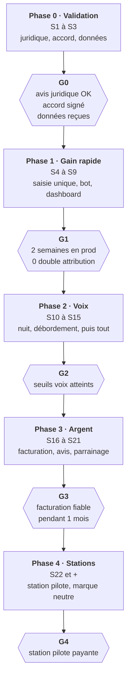
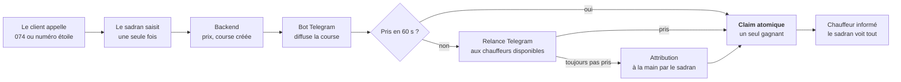
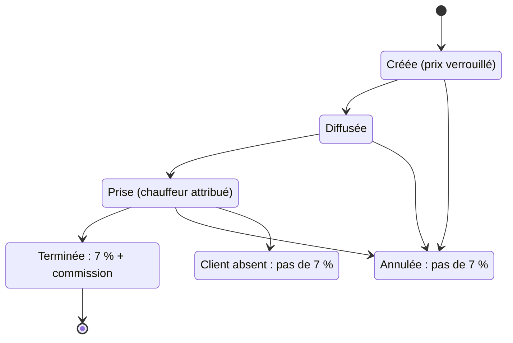

# Plan détaillé par phase

Mis à jour le 4 octobre 2026. Version de travail : les durées sont des estimations en semaines, à recaler dès que chacun aura donné ses heures disponibles.

On rend Driverss rentable en automatisant le travail des sadranim, puis on revend le système à d'autres stations. Rien ne part en production avant un avis juridique favorable et un accord signé avec Yossef.

## Principes

- **Valider avant de construire.** Juridique, accord et données d'abord (Phase 0).
- **Livrer d'abord ce qui soulage sans risque.** Le sadran saisit la course une seule fois, le système trouve le chauffeur (Phase 1). La voix arrive ensuite, progressivement (Phase 2).
- **Un humain toujours joignable**, à chaque phase.
- **Rester simple.** Oren est le seul développeur expérimenté : services clés en main (Supabase, ElevenLabs, Telegram), et tout code qui touche l'argent ou l'attribution passe par une revue d'Oren.
- **Plusieurs stations dès le premier jour** (`station_id` dans chaque table), pour pouvoir revendre.
- **Telegram uniquement** pour les chauffeurs : plus de WhatsApp, ni comme canal principal ni comme repli.

## Vue d'ensemble

Cinq phases, chacune fermée par une porte : on passe à la suivante seulement si ses critères sont remplis. Environ 21 semaines avant d'attaquer les autres stations.

En parallèle : le prototype vocal d'Eitan démarre dès la Phase 1, hors production. La prospection des stations (Papa, Eitan) commence pendant la Phase 3.

## L'équipe

| Personne | Profil | Rôle permanent | Décide de |
| --- | --- | --- | --- |
| Oren | Développeur ETL (intégration de données), Technion | Responsable technique : backend, base de données, contrats d'API, sécurité, import des données, revue du code des autres | Architecture, schéma, statuts des courses, ce qui part en production |
| Eitan | Études de business, 7 ans de vente, sait utiliser Claude Code et les agents vocaux ElevenLabs | Produit et business : négociation de l'accord, agent vocal, puis vente aux autres stations | Priorités produit, conditions commerciales (validées à quatre) |
| Ilan | A étudié au Technion, sait utiliser Claude Code | Dispatch et opérations : bot de diffusion, dashboard du sadran, pilote avec les chauffeurs, tests de bout en bout | Expérience chauffeur et sadran, déroulé du pilote |
| Papa | Driver, connaît le terrain | Terrain et relation : interlocuteur de Yossef au quotidien, recrutement des chauffeurs testeurs, retours terrain, portes des stations | Ce qui est acceptable pour les chauffeurs |

**Pourquoi Ilan ne touche pas au backend :** son code ne manipule jamais l'argent ni l'attribution. Son bot, sa Mini App et son dashboard appellent seulement des endpoints d'Oren. Le claim atomique et la sécurité restent chez Oren.

**Le risque d'organisation :** Oren est le goulot d'étranglement. Les parades : des services clés en main, un nombre d'endpoints réduit, et l'agent vocal configuré par Eitan dans l'interface ElevenLabs plutôt qu'en code.

**Règles de travail**

- Un point hebdomadaire de 30 minutes à quatre, et une décision écrite (dans `DECISIONS.md`) à chaque fois qu'on tranche quelque chose.
- Un seul dépôt de code. Tout ce qui touche l'argent, les statuts ou les secrets passe par une revue d'Oren avant fusion.
- Un changement de contrat d'API est annoncé aux autres avant d'être fusionné.
- Une fonctionnalité n'est « finie » qu'après un test de bout en bout où la donnée finale en base est correcte.
- Avec Yossef, une seule voix au quotidien : Papa. Eitan mène la négociation de l'accord.

---

## Phase 0 — Validation (semaines 1 à 3)

Objectif : savoir si on y va, et à quelles conditions. Pas de code de production, seulement des prototypes jetables.

Le risque n°1 est juridique. Transporter des passagers contre paiement sans licence de taxi est illégal en Israël ([Maariv, 2023](https://www.maariv.co.il/news/israel/Article-1032269)). La police a encore arrêté des driverim à Jérusalem en juillet 2026 ([Kikar](https://www.kikar.co.il/police/ti3p39)), et Uber a dû arrêter ses services avec chauffeurs privés en 2017 ([Fortune](https://fortune.com/2017/11/27/uber-israel-ban)).

**Papa**

- [ ] Présenter le plan à Yossef et organiser une réunion de lancement à cinq.
- [ ] Obtenir de Yossef : l'export du logiciel (courses, prix, clients, soldes), 20 enregistrements d'appels, 50 messages de courses tels que postés dans les groupes, la liste des chauffeurs actifs.
- [ ] Repérer 10 chauffeurs testeurs et noter quel téléphone ils ont.
- [ ] Annoncer aux chauffeurs le passage à Telegram et les aider à l'installer.

**Eitan**

- [ ] Négocier et faire rédiger l'accord : parts, redevance par course avec minimum mensuel, propriété du code et des données (chez nous), droit de revendre à d'autres stations, coûts variables refacturés, exclusivité limitée, gouvernance, sortie si Driverss s'arrête.
- [ ] Trouver un avocat (droit des transports et des sociétés) et lui envoyer les questions ci-dessous.
- [ ] Créer le compte ElevenLabs et monter une démo vocale sur les 20 enregistrements, hors production.

**Oren**

- [ ] Analyser l'export : panier moyen réel, part des courses interurbaines, clients actifs parmi les 756, courses par chauffeur, taux de recouvrement des commissions.
- [ ] Décider qui est la source de vérité pour les soldes de 7 % : le logiciel de Yossef ou le nôtre (selon qu'il a une API ou un export).
- [ ] Décider avec Papa comment le prix est fixé : table fixe ou négocié dans le groupe.
- [ ] Écrire le schéma v0 et les contrats d'API v0.
- [ ] Prototype jetable, hors production : initData Telegram → session Supabase → canal Realtime privé, pour trancher l'authentification de la Mini App (D-011).
- [ ] Vérifier que la clause d'exclusivité ne bloque pas le projet de dispatch de colis d'Oren.

**Ilan**

- [ ] Observer sur place comment un sadran traite une course aujourd'hui, et l'écrire étape par étape.
- [ ] Collecter avec Papa les codes et formats de messages des chauffeurs.
- [ ] Valider Telegram pendant une semaine avec les 10 chauffeurs : installation, téléphones filtrés, bouton « je prends », ouverture d'une Mini App de démonstration jetable (filtres, version de Telegram, temps réel). Lister ceux qui ne peuvent pas installer Telegram ou ouvrir la Mini App.
- [ ] Prendre en main Supabase et Claude Code sur un mini-projet, avec deux sessions en binôme avec Oren.

**Questions pour l'avocat**

1. Les chauffeurs ont-ils le droit de transporter des passagers ? Qu'est-ce qui change pour les colis ?
2. Quel risque pour une société tech qui licencie le logiciel à Driverss ?
3. Comment traiter les dons de 7 % via Nedarim Plus, et qui reçoit le reçu fiscal ?
4. Les soldes de 7 % non utilisés sont-ils une dette envers les clients ?
5. Enregistrements d'appels et parrainage : que faut-il pour respecter l'amendement 13 de la loi sur la vie privée, en vigueur depuis le 14 août 2025 ([Pearl Cohen](https://www.pearlcohen.com/israel-significant-amendment-to-the-privacy-law-takes-effect/)) ?

**Porte G0 : on continue seulement si**

- l'avis juridique est acceptable ;
- l'accord est signé ;
- les données sont reçues.

Si l'avocat dit non pour les passagers, deux pistes de repli : vendre directement le système aux stations de taxi licenciées (la Phase 4 avance), ou se limiter aux colis.

À décider aussi avec Yossef : le lancement Nedarim Plus est annoncé dans environ un mois. Soit on le décale jusqu'à la fin de la Phase 1, soit il démarre avec les sadranim humains seuls.

---

## Phase 1 — Gain rapide sans voix (semaines 4 à 9)

Objectif : le sadran répond toujours au téléphone, mais il saisit la course une seule fois. Le système calcule le prix, la diffuse, trouve le chauffeur et enregistre tout. Plus de ressaisie dans le logiciel.

Si personne ne prend la course en 60 secondes, le bot la relance aux chauffeurs disponibles (D-014), puis le sadran l'attribue à la main. Dans tous les cas — bot, Mini App ou sadran — l'attribution passe par le claim atomique du backend.

Proposition à valider avec Yossef : ni crédit de 7 % ni commission pour une course annulée ou un client absent.

**Oren**

- [ ] Créer le schéma Supabase : stations, clients, lieux et alias, prix, institutions, chauffeurs, courses, événements de course, grand livre des 7 %. `station_id` dans chaque table, règles d'accès (RLS).
- [ ] Importer les données de Yossef.
- [ ] Endpoints : création de course depuis le dashboard, calcul du prix, claim atomique, changement de statut (terminée, annulée, client absent).
- [ ] Contrats chauffeur ([`MINIAPP.md`](MINIAPP.md), contrats J à R) : inscription Telegram, authentification de la Mini App, lecture des courses, claim, disponibilité, signaux temps réel, événement `ride_status_changed`. L'éligibilité (qui est notifié, qui peut prendre) est calculée par le backend.
- [ ] Créditer les 7 % et compter la commission uniquement au statut « terminée ».
- [ ] Brancher la synchro avec le logiciel de Yossef, selon la décision de la Phase 0.
- [ ] Sécurité : secrets côté serveur uniquement, signature des webhooks, pas de numéro de client dans un message de groupe.
- [ ] Relire chaque modification d'Ilan avant fusion.

**Ilan**

- [ ] Dashboard du sadran, sur mobile et en hébreu (droite à gauche) : formulaire de saisie, courses en direct, chauffeurs, statuts.
- [ ] Bot Telegram : inscription des chauffeurs par partage du contact, notification en message privé aux destinataires choisis par le backend, au format qu'ils utilisent déjà, bouton « je prends » qui appelle le claim d'Oren, message privé au gagnant.
- [ ] Repli : course non prise en 60 secondes, le bot la relance aux chauffeurs disponibles et elle est surlignée dans le dashboard pour que le sadran l'attribue à la main.
- [ ] Mini App chauffeur ([`MINIAPP.md`](MINIAPP.md)) : courses disponibles en direct, claim, mes courses, disponibilité. Après le bouton du bot : la porte G1 n'en dépend pas.
- [ ] Lancer le pilote avec les 10 chauffeurs, puis l'ouvrir à tous.
- [ ] Envoyer chaque semaine les mesures du pilote.

**Eitan**

- [ ] Prototype vocal hors production sur les vrais enregistrements : prompt en hébreu, dictionnaire des villes, quartiers et synagogues, mesure du taux de compréhension.
- [ ] Suivre Nedarim Plus : date de lancement, API disponible ou non, affiches pour les gabbaïm.
- [ ] Préparer avec Yossef l'annonce du nouveau fonctionnement aux chauffeurs : tout passe par Telegram.

**Papa**

- [ ] Former les sadranim au dashboard et les chauffeurs au bot.
- [ ] Faire remonter chaque semaine les problèmes du terrain.
- [ ] Gérer les chauffeurs réticents.

**Ce qu'on mesure chaque semaine :** temps de saisie d'une course, délai avant qu'un chauffeur la prenne, part des courses non prises en 60 secondes, doubles attributions, part des claims par canal (bot, Mini App), écarts de solde avec l'ancien logiciel.

**Porte G1 :** pendant deux semaines de suite, toutes les courses passent par le système, aucune double attribution, et les soldes concordent.

---

## Phase 2 — La voix, progressivement (semaines 10 à 15)

Objectif : l'agent vocal prend les commandes, d'abord la nuit et en débordement, puis sur tous les appels si les seuils sont atteints. À tout moment, la touche 0 transfère vers un sadran.

**Eitan**

- [ ] Passer l'agent ElevenLabs en production sur la nuit et le débordement.
- [ ] Transfert vers un humain : touche 0, demande du client, ou lieu toujours incompris après une relance.
- [ ] Régler l'agent chaque semaine à partir des enregistrements des appels ratés.
- [ ] Brancher le trunk SIP du 074 et du numéro étoile, avec Oren en appui.

**Oren**

- [ ] Outils appelés par l'agent : identifier le client, calculer le prix, créer la course. L'agent n'invente jamais un prix.
- [ ] Webhook de fin d'appel : transcription, durée, résultat, enregistrement privé.
- [ ] Fermeture automatique pendant Shabbat et les fêtes.
- [ ] Tableau des mesures de la voix.

**Ilan**

- [ ] Vue des appels dans le dashboard : transcriptions, appels transférés, échecs.
- [ ] Tests de bout en bout : accents, bruit, ville marmonnée, interruption, clavier, transfert.

**Papa**

- [ ] Recueillir l'avis des clients, surtout les plus âgés.
- [ ] Écouter chaque semaine un échantillon d'appels avec Eitan.

**Porte G2 (seuils proposés, à valider avec Yossef) :** au moins 85 % des commandes complètes sans humain, moins de 2 % d'erreurs d'adresse, et un transfert qui marche à chaque fois. Ensuite seulement, on étend la voix à tous les appels.

**Coût à surveiller :** ElevenLabs facture 0,08 $ la minute d'appel, plus le modèle de langage et la téléphonie ([Macha, septembre 2026](https://www.getmacha.com/blog/elevenlabs-agents-pricing-explained)). L'intégration téléphonique passe par un trunk SIP, avec transfert possible vers un humain ([documentation ElevenLabs](https://elevenlabs.io/docs/eleven-agents/phone-numbers/sip-trunking)).

---

## Phase 3 — L'argent (semaines 16 à 21)

Objectif : encaisser automatiquement la commission et l'abonnement des chauffeurs, collecter les avis clients, et faire grandir la base par parrainage, avec consentement.

**Oren**

- [ ] Facturation des chauffeurs via un prestataire israélien (Cardcom, Tranzila ou Grow) : carte enregistrée ou prélèvement, commission par course, abonnement mensuel.
- [ ] Factures automatiques (Morning ou iCount).
- [ ] Blocage automatique d'un chauffeur en retard de paiement, avec déblocage manuel possible.
- [ ] Rapprochement mensuel entre le grand livre, les paiements et les soldes clients.

**Ilan**

- [ ] Écrans de facturation dans le dashboard : qui doit quoi, qui est bloqué.
- [ ] Avis clients automatiques par SMS après chaque course terminée, avec une alerte en cas de mauvaise note.

**Eitan**

- [ ] Parrainage et tirage au sort : l'ami parrainé confirme lui-même par SMS avant d'être inscrit (amendement 13).
- [ ] Fixer avec Yossef le prix de l'abonnement chauffeur, à partir des chiffres réels des Phases 1 et 2.

**Papa**

- [ ] Annoncer l'abonnement aux chauffeurs et répondre aux objections.
- [ ] Suivre les impayés délicats.

**Porte G3 :** un mois de facturation sans erreur, et un taux de recouvrement au moins aussi bon qu'avant.

Ce qu'on ne fait pas encore : l'application ou le bot pour le grand public, et la ligne de consultation de solde. On les reconsidère après G3, selon les chiffres.

---

## Phase 4 — Les autres stations (à partir de la semaine 22)

Objectif : signer une première station pilote sous une marque neutre (pas « Driverss »), avec les chiffres réels de Driverss comme preuve. La prospection peut commencer dès la semaine 16, en parallèle de la Phase 3.

**Eitan**

- [ ] Repérer les logiciels de dispatch déjà vendus aux stations, et leurs prix, avant de fixer les nôtres.
- [ ] Préparer l'argumentaire : coût réel des sadranim de la station, appels décrochés 24 h/24, coût par course qui baisse.
- [ ] Mener les rendez-vous et proposer un pilote de 30 jours sur les nuits et le débordement, sans risque pour la station.
- [ ] Signer ensuite un abonnement plus des frais par course.

**Papa**

- [ ] Lister les stations qu'il connaît, leur taille et qui y décide.
- [ ] Ouvrir les portes et accompagner Eitan au premier rendez-vous.

**Oren**

- [ ] Rendre le multi-stations réel : marque, voix, zones, prix et règles par station.
- [ ] Créer une procédure pour installer une nouvelle station (import des lieux et des prix, numéros, chauffeurs).
- [ ] Refacturer les coûts variables au prix coûtant.

**Ilan**

- [ ] Déployer et former la station pilote.
- [ ] Assurer le support pendant le pilote et envoyer les mesures chaque semaine.

**Porte G4 :** la station pilote passe en abonnement payant à la fin des 30 jours.

---

## Risques et parades

| Risque | Parade | Qui suit |
| --- | --- | --- |
| Légalité : chauffeurs privés qui transportent des passagers contre paiement | Avis d'avocat en Phase 0, pistes de repli (stations licenciées, colis) | Eitan |
| Notre propre organisation : qui décide, comment on partage entre nous | Pacte écrit entre nous quatre en Phase 0, avant l'accord avec Yossef | Eitan |
| Capacité : emplois à temps plein, Oren goulot d'étranglement | Services clés en main, V1 réduite, calendrier recalé sur les heures réelles. Prévoir moins de disponibilité d'Oren autour du mariage, fin 2026 | Oren |
| Dépendance : un fondateur unique de 20 ans, un partenaire unique (Nedarim Plus) | Accord : code et données chez nous, droit de revendre, sortie prévue | Eitan |
| Preuves minces : 30 courses par jour sur deux mois | Décider sur les chiffres mesurés en Phase 1, pas sur les projections | Oren |
| La ligne cachée aux concurrents (voie B) finit par se savoir | Ne construire aucune fonctionnalité qui dépend du secret | Tous |
| Les chauffeurs n'adoptent pas l'outil, les concurrents font pression | Même format de message qu'aujourd'hui, Papa sur le terrain | Papa |
| Des chauffeurs ne peuvent pas installer Telegram (téléphones filtrés) ou n'en veulent pas | Test en Phase 0 avec les 10 chauffeurs, aide à l'installation par Papa. Ceux qui restent sans Telegram reçoivent leurs courses par téléphone, via le sadran | Ilan et Papa |
| La Mini App ne s'ouvre pas sur certains téléphones (filtres, vieilles versions de Telegram), ou le temps réel y est bloqué | Test en Phase 0 ; le bouton « je prends » du bot reste un chemin complet ; repli par polling | Ilan |
| Reconnaissance vocale : hébreu orthodoxe, yiddish, noms de rues, mauvais son | Voix hors chemin critique, seuils de la porte G2 | Eitan |
| Recouvrement : les chauffeurs encaissent en liquide | Facturation automatique et blocage en Phase 3 | Oren |
| Vie privée : enregistrements d'appels, numéros parrainés | Stockage privé, consentement de l'ami parrainé, avis de l'avocat sur l'amendement 13 | Oren |
| Soldes de 7 % = dette envers les clients ; fiscalité des dons et des retraits en liquide des gabbaïm | Questions à l'avocat et à un comptable en Phase 0 | Eitan |

## Informations manquantes

**Disponibilités, à remplir par chacun**

| Personne | Heures par semaine | Contraintes connues |
| --- | --- | --- |
| Oren | | |
| Eitan | | |
| Ilan | | |
| Papa | | |

**Non trouvé en ligne**

- Une API publique de Nedarim Plus : aucune documentation trouvée. À demander directement.
- La liste des logiciels de dispatch déjà vendus aux stations israéliennes : tâche d'Eitan en Phase 4.

**Questions à poser à Yossef (Papa et Eitan)**

- [ ] Répartition réelle des prix de course et part des courses interurbaines ?
- [ ] Combien de clients actifs parmi les 756, et combien de courses par client et par mois ?
- [ ] Combien d'appels aboutissent à une course, et pourquoi les autres échouent ?
- [ ] Heures de pointe ? Que se passe-t-il la nuit et le vendredi ?
- [ ] Combien de chauffeurs actifs, combien de courses chacun par jour, combien paient-ils aujourd'hui ?
- [ ] Comment le prix est-il fixé aujourd'hui : table ou négociation dans le groupe ?
- [ ] Que peuvent faire les clients avec leur solde de 7 %, et quel montant total est dû aujourd'hui ?
- [ ] Quel logiciel gère le club clients ? A-t-il une API ou un export ?
- [ ] Quel opérateur gère le 074 et le numéro étoile ? Peut-on les rediriger vers notre système ?
- [ ] Les appels sont-ils enregistrés ? Peut-on en avoir pour nos tests ?
- [ ] Contrat Nedarim Plus : commission, exclusivité, propriétaire du numéro étoile, date de lancement réelle, nombre d'institutions engagées ?
- [ ] Les chauffeurs sont-ils des taxis licenciés, des voitures privées, ou un mélange ? Avec quelle assurance ? Un avocat a-t-il déjà donné un avis ?
- [ ] Qui d'autre est actionnaire de Driverss ou a des droits dessus ?
- [ ] Quelle participation, quelle redevance et quelle exclusivité est-il prêt à accepter ? Qui finance le développement au départ ?

## Sources

Documents internes : le plan de Yossef (« Driverss Full Plan »), la synthèse familiale (« driverss-plan-fr ») et le plan de répartition de la Phase 1.

- [Maariv — les driverim et la légalité (août 2023)](https://www.maariv.co.il/news/israel/Article-1032269)
- [Kikar HaShabbat — arrestations de driverim à Jérusalem (juillet 2026)](https://www.kikar.co.il/police/ti3p39)
- [Fortune — Uber interdit de services avec chauffeurs privés en Israël (novembre 2017)](https://fortune.com/2017/11/27/uber-israel-ban)
- [Pearl Cohen — entrée en vigueur de l'amendement 13 sur la vie privée](https://www.pearlcohen.com/israel-significant-amendment-to-the-privacy-law-takes-effect/)
- [ElevenLabs — documentation SIP trunking](https://elevenlabs.io/docs/eleven-agents/phone-numbers/sip-trunking)
- [Macha — tarifs des agents ElevenLabs (septembre 2026)](https://www.getmacha.com/blog/elevenlabs-agents-pricing-explained)
